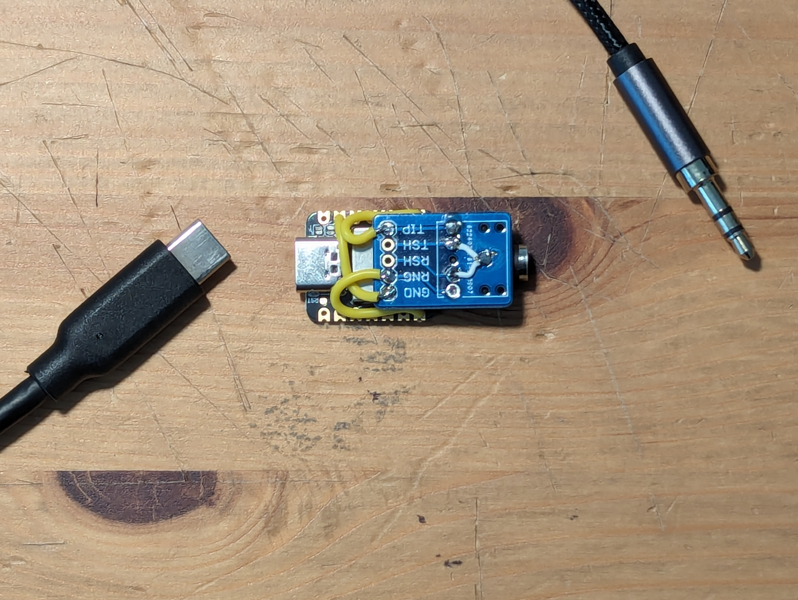
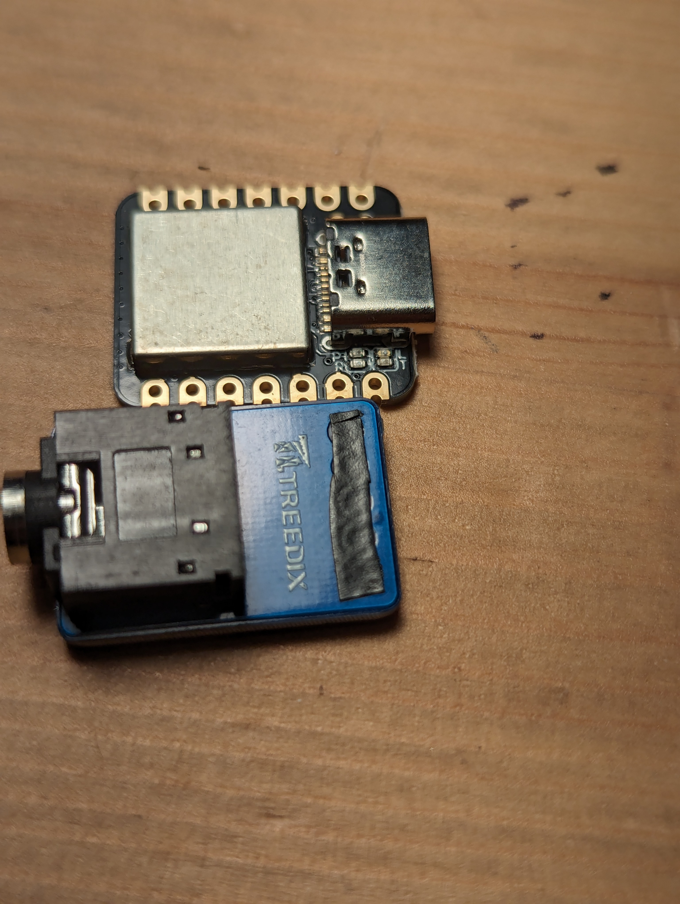
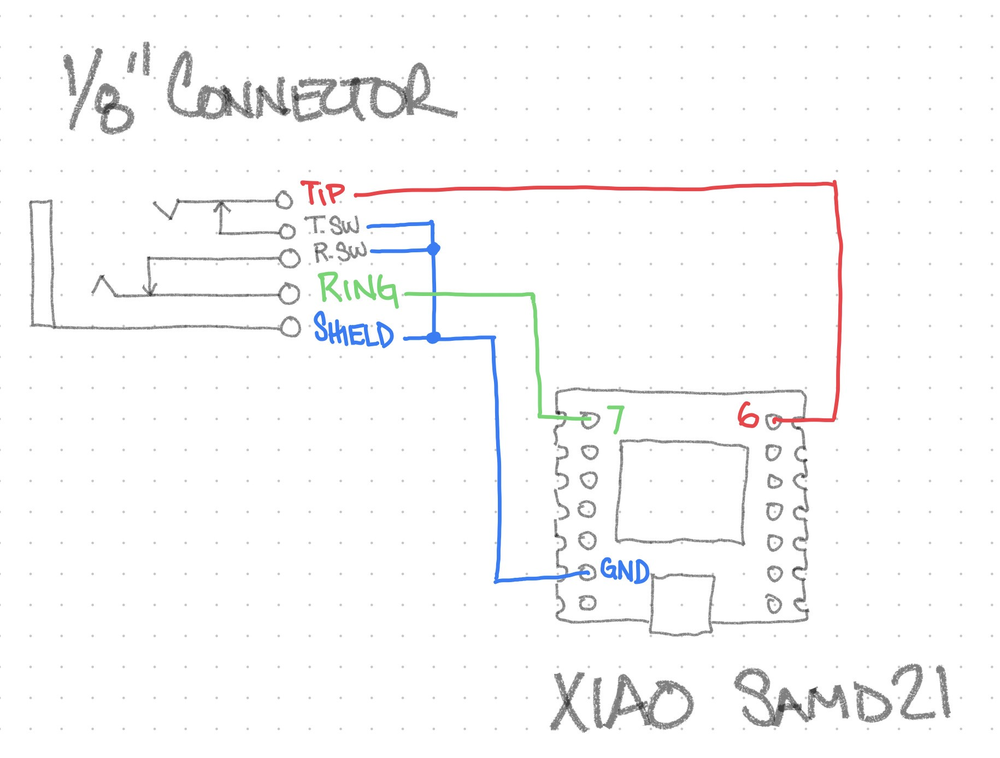

# CW2USBKB
A project to enable me to use a real CW Key with Morse Mania, a CW trainer for the Android platform.

Based largely on a project from Hackaday.io: https://hackaday.io/project/184702-morse-code-usbhid-interface-the-gadget

I've never used anysort of microcontroller before and this was a fun project to learn with - took me about a day to get it up and running and a couple hours to solder up the final verision seen below. 

I know you can buy similar devices for around 25 bucks, but what's the fun in that? This was less than $15 in parts and I leaned something new. win,win.

# The Plan

Using a seeeduino to convert CW contact closures to keyboard presses. 
configure for Straight Key or Paddle
Morse Mainia or Vband

# Function

The device is powered over USB C. 

All prompts are conveyed via the built in LED using Morse Code (of course!) 

On power up '77' is sent via LED (Long live CW!)

Next the LED will prompt 's or p' for mode selection.

  * Sending a 'dit' on a straight key will select straight key mode.
    * Straight key mode sends `space bar` presses

  * Sending a 'dah' on a paddle (right paddle) will select paddle mode.
      * Paddle mode will send an `a` for the left paddle and a `s` for the right 

You are now ready to play!

# History

**1.0 8JAN2023** Initial relase
  functional. works with staight key or paddle. Only a single output configuration based off of Morse Mainia for Android. Straight key send space bar, left paddle sends 'a' right paddle sends 's'.

# Parts List

  * 'Seeduino' XIAO SAMD21 [Seeed Studio](https://www.seeedstudio.com/Seeeduino-XIAO-Arduino-Microcontroller-SAMD21-Cortex-M0+-p-4426.html)
  * 3.5mm Female Audio Jack w/breakout board [Amazon](https://www.amazon.com/gp/product/B08H8DR7ZW/ref=ppx_yo_dt_b_search_asin_title?ie=UTF8&psc=1)
  * Misc. wire (24-30 awg)
  * Heatshrink

# Construction

The device is basically a 1.8" TRS breakout board JB welded (yes, JB Weld is magic!) to the top of the Seeeduino. Some 26awg wire completes the IO connections.

The smaller, white, 30awg wires connect the tip and ring switches to ground so I can detect when there is no plug in the socket (I was thinking I may use this to re-trigger mode selection)

I did mask the backside of the beakout board so that the solder connections would not short out against the metal case of the seeduino it was getting welded to. 

# Wiring

Note: the wiring of the two tip and ring switches isn't currently implemented in code so it's not needed for the device to function at this point.

